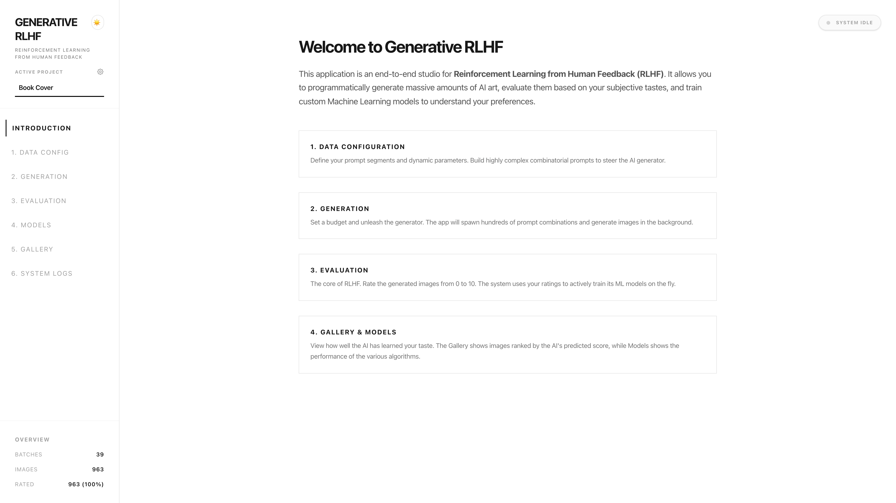
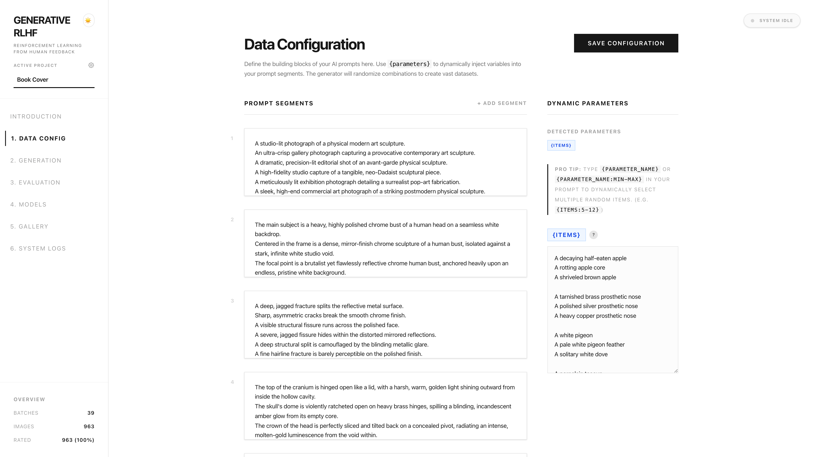
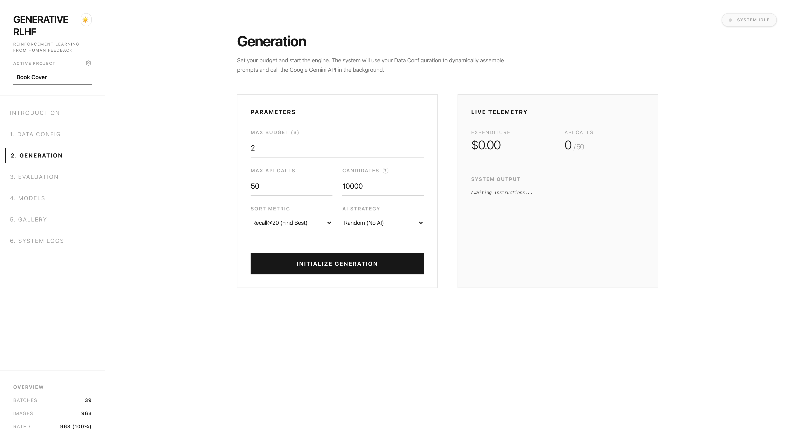
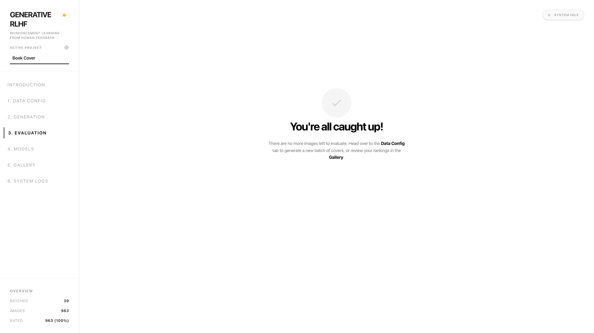
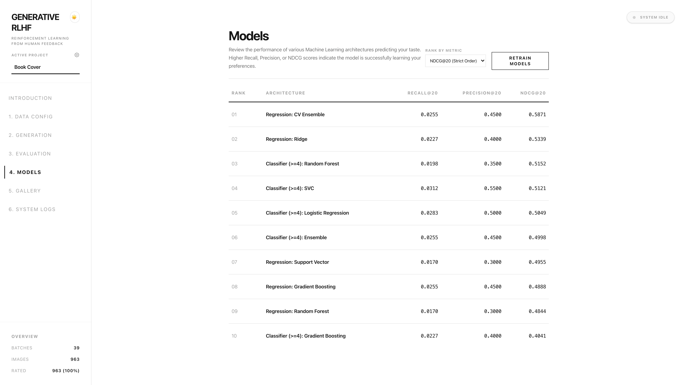
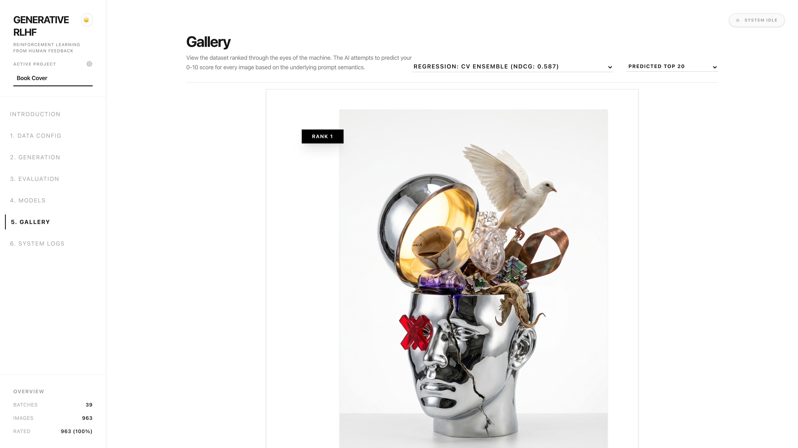
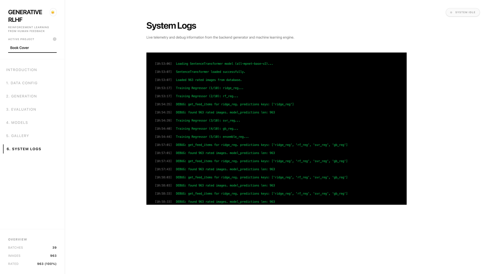

# Generative RLHF


An end-to-end RLHF (Reinforcement Learning from Human Feedback) platform for optimizing Generative AI image prompts. You generate images, rate them based on your aesthetic preferences, and the app automatically trains machine learning models to discover and predict the exact prompt combinations that will produce the style of images you like best.

> **Background:** I originally built this tool to systematically design the perfect cover for my book. I needed a way to explore thousands of prompt variations and use AI to quickly zero in on the exact aesthetic I was looking for.

## 🚀 Quick Start

Ensure you have **Python 3.9+** and **Node.js 18+** installed.

**1. Configure API Keys**
```bash
cp .env.example .env
# Edit .env with your Gemini API Key and Google Sheets OAuth credentials
```

**2. Start Backend (Terminal 1)**
```bash
pip install -r requirements.txt
OMP_NUM_THREADS=1 TOKENIZERS_PARALLELISM=false uvicorn backend.main:app --port 8000
```

**3. Start Frontend (Terminal 2)**
```bash
cd frontend
npm install
npm run dev
```

Open `http://localhost:5173` (or the port Vite provides) to access the dashboard!

---

## 💻 Features

- **Project Management:** Isolate datasets, models, and image histories across multiple project workspaces. Duplicate or "fork" projects instantly.
- **Mission Control:** Start and stop the generation loop. The generation runs natively in a background thread with live console logs streamed to the UI.
- **Active Learning Rating Room:** Rapidly rate images (0-10) using your keyboard. The backend automatically switches to active learning strategies to present the highest-uncertainty images.
- **ML Models Dashboard:** Automatically trains multiple regressor architectures (Ridge, Random Forest, SVR, Gradient Boosting, Ensembles) and ranks them instantly by NDCG, Recall, and Precision.
- **Gallery & Themes:** Review how the machine predicts your taste compared to your actual ratings. Switch between multiple gorgeous UI themes (Classic Light, Zinc Dark, Cyberpunk Glass).

---

## 📖 Tutorial

### 1. Introduction

Configure your project settings, manage active workspaces, and prepare for image generation.

### 2. Data Config

Configure your API keys and define foundational prompt components. These components are systematically combined to generate vast arrays of unique new prompts. Over time, the AI learns exactly which combinations of these components produce the best aesthetic results.

### 3. Generation

Start the generation loop and monitor the live progress. The backend actively streams statuses directly to the dashboard.

### 4. Evaluation

Rate generated images to build your preference dataset. The active learning module ensures you're rating the most informative images.

### 5. Models

Train various regressor models to predict how you will rate unseen images. The system evaluates them instantly using metrics like NDCG and Recall to find the most accurate model. This best-performing model is then deployed to automatically generate and curate better prompts in the future.

### 6. Gallery
The Gallery provides multiple views to explore how well the machine predicts your taste compared to your actual ratings.

**Single View**

Review the predicted rankings of your images in a beautiful, focused single view.

**Full Grid**

View the full dataset grid.

**Side-by-Side Comparison**

Compare model predictions side-by-side. Each column represents the Top 20 for a different trained model.

### 7. System Logs

Review system operations, server history, and debugging information without leaving the browser.
